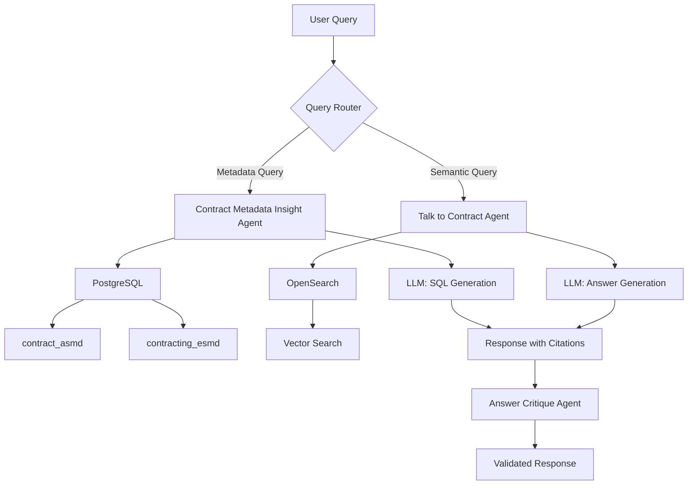
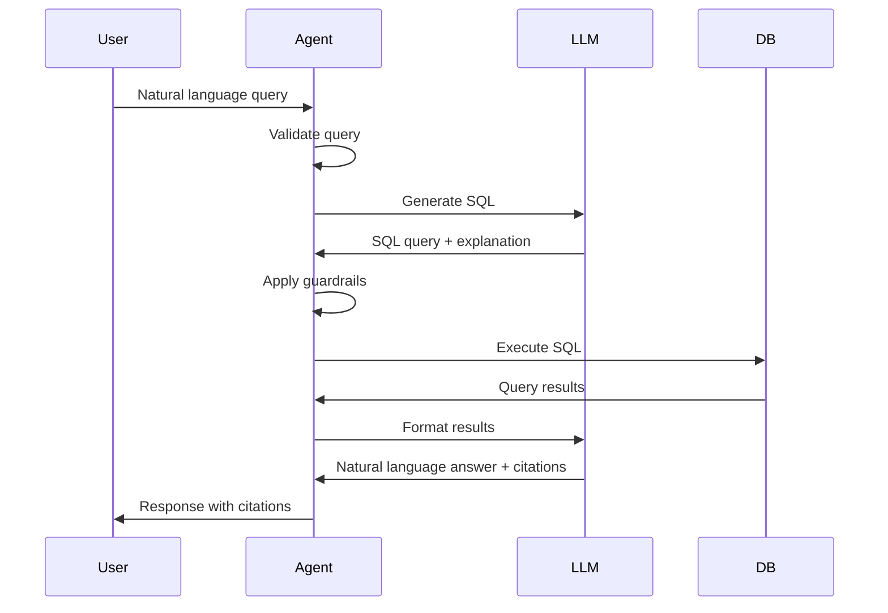

# Contramate Documentation

Welcome to **Contramate** - a powerful contract analysis and metadata extraction platform powered by AI agents and intelligent document processing.

## Overview

Contramate is designed to help organizations analyze, extract insights from, and interact with contract documents at scale. Using advanced LLM-powered agents and structured metadata extraction, Contramate makes contract analysis fast, accurate, and intuitive.

## Key Features

### 🤖 AI-Powered Agents

- **Contract Metadata Insight Agent**: SQL-based agent for querying structured contract metadata
- **Talk to Contract Agent**: Vector-powered semantic search across contract content
- **Query Rewriter**: Contextualizes queries with conversation history
- **Clarifier Agent**: Interactive query clarification for ambiguous requests
- **Answer Critique**: Validates answer completeness and quality

### 📊 Structured Metadata Extraction

- **Application Structured Metadata (ASMD)**: 60+ clause-level fields including non-compete, IP ownership, termination clauses
- **Extracted Structured Metadata (ESMD)**: 30+ financial and operational fields including contract values, payment terms, deliverables

### 🔍 Dual Query Modes

- **Metadata Queries**: Fast SQL-based queries across structured contract data
- **Semantic Search**: Deep document analysis using vector embeddings and OpenSearch

### 🛡️ Safety & Guardrails

- Query validation and guardrails to prevent unsafe operations
- Automatic filter application based on context
- Token tracking and usage monitoring
- Comprehensive error handling and retry logic

## Architecture



## Quick Start

### Installation

```bash
# Clone the repository
git clone https://github.com/MrDataPsycho/contra.mate.git
cd contra.mate

# Install dependencies with uv
uv sync

# Set up environment variables
cp .envs/local.env.example .envs/local.env
# Edit .envs/local.env with your configuration

# Start infrastructure with Docker Compose
docker compose up -d
```

### Basic Usage

```python
from contramate.core.agents.contract_metadata_insight import (
    ContractMetadataInsightAgentFactory
)

# Create agent
agent = ContractMetadataInsightAgentFactory.create_default()

# Query contracts
result = await agent.run("How many contracts have non-compete clauses?")

print(result["answer"])
print(result["citations"])
```

## Data Pipeline

Contramate processes contracts through multiple stages:

1. **Bronze Layer**: Raw contract PDFs and text files
2. **Silver Layer**: Extracted and cleaned text with metadata
3. **Gold Layer**: Structured ASMD data (clause analysis)
4. **Platinum Layer**: Enhanced ESMD data (financial/operational extraction)

## Agent System

### Metadata Query Flow



## Technology Stack

- **Python 3.12+**: Core language
- **OpenAI API**: LLM for agent intelligence
- **PostgreSQL**: Structured metadata storage
- **OpenSearch**: Vector search and document retrieval
- **DynamoDB**: Conversation history storage
- **FastAPI**: API backend
- **Next.js**: Frontend interface
- **Docker**: Containerization and deployment

## Key Concepts

### Citations

All agent responses include citations that reference the data source:

```json
{
  "answer": "Found 45 contracts with non-compete clauses [doc1].",
  "citations": {
    "doc1": "Database: contract_asmd table (Application Structured Metadata)"
  }
}
```

### Query Guardrails

The system enforces strict safety rules:

- ✅ Only SELECT queries allowed
- ✅ All queries must include WHERE or LIMIT clauses
- ✅ Maximum LIMIT of 1000 rows
- ❌ No INSERT, UPDATE, DELETE, DROP operations
- ❌ No queries that could pull entire tables

### Filters

Agents intelligently apply filters based on query context:

- Project-specific queries automatically filter by `project_id`
- Contract-specific queries filter by `reference_doc_id`
- Type-specific queries filter by `contract_type`

## Example Queries

### Metadata Queries

```python
# Count contracts by type
"How many Service Agreements do we have?"

# Analyze clauses
"Show me contracts with both non-compete and IP ownership clauses"

# Financial analysis (with ESMD)
"What's the average contract value for Development Agreements?"

# Join queries
"Find contracts with termination clauses that also have payment schedules"
```

### Semantic Queries

```python
# Content search
"What are the termination conditions in this contract?"

# Multi-document analysis
"Compare payment terms across all Service Agreements"

# Specific clause extraction
"Extract all confidentiality obligations from contracts with Microsoft"
```

## Next Steps

- [Installation Guide](getting-started/installation.md) - Detailed setup instructions
- [Quick Start Tutorial](getting-started/quickstart.md) - Step-by-step guide

## Support

- 📖 [Documentation](https://mrdatapsycho.github.io/contra.mate/)
- 🐛 [Issue Tracker](https://github.com/MrDataPsycho/contra.mate/issues)
- 💬 [Discussions](https://github.com/MrDataPsycho/contra.mate/discussions)

## License

This project is licensed under the MIT License - see the LICENSE file for details.
